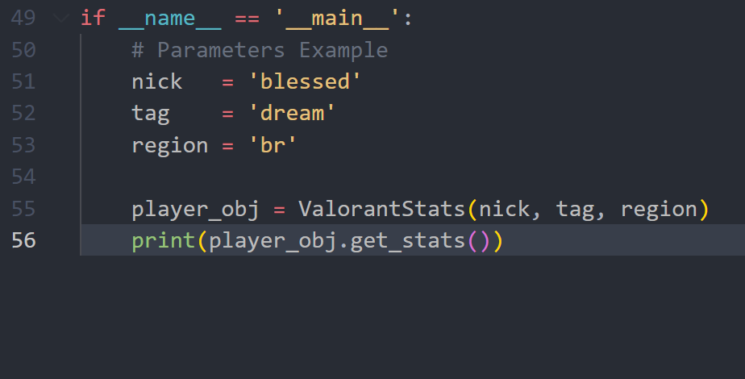
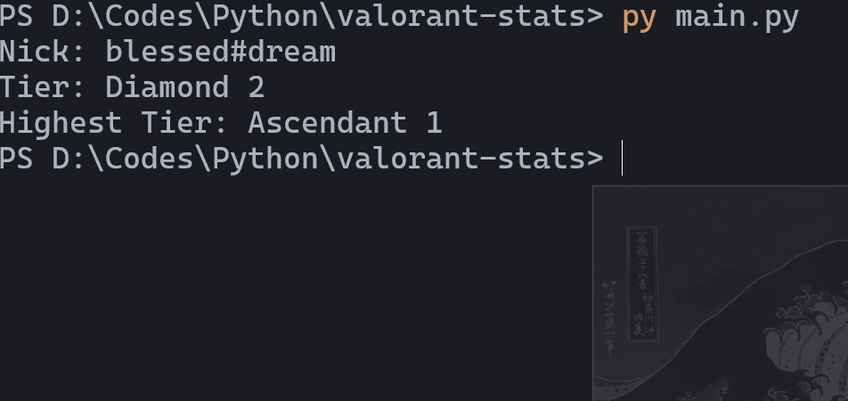

# Valorant Stats
> This is a simple example of consume APIs

## Requirements
- Only Python 3.X installed.

## How to execute?
1. Instance a object for a account player

2. Execute the `main.py` file:
```sh
python3 main.py
```
3. Enjoy!
